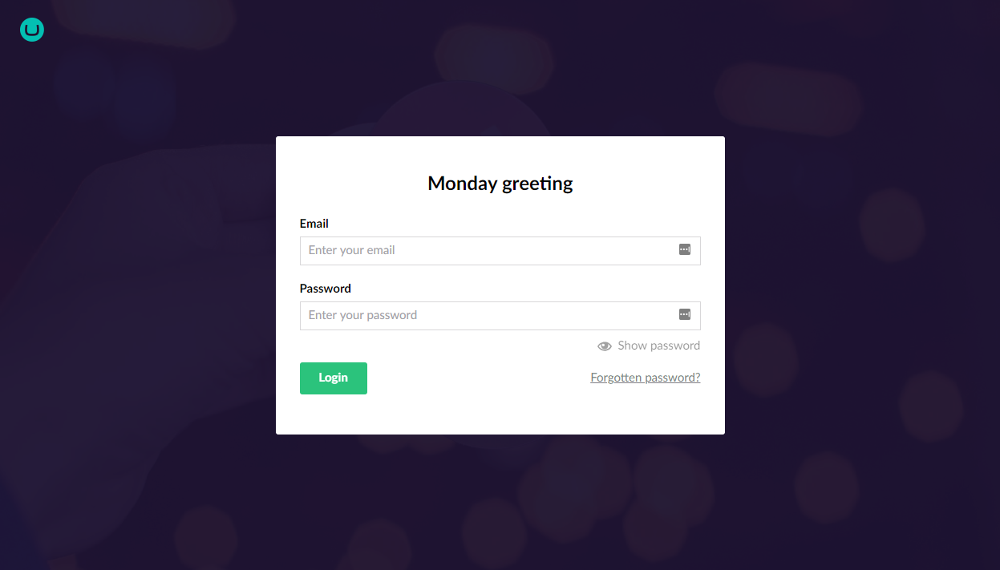
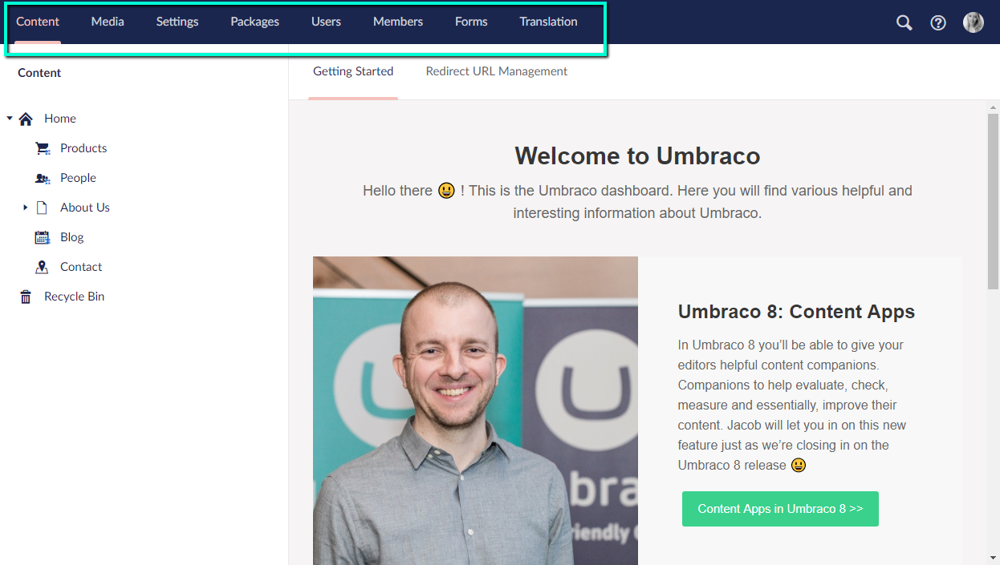

Backoffice
==========================================

.. toctree:: 
  :maxdepth: 2
  :hidden:

  sections.md
  login.md
  logviewer.md
  variants.md
  property-editors/README.md

In this article you can learn more about the common terms and concepts that are used throughout the Umbraco backoffice.

`Login screen <login.md>`__
------------------------------------

When you go to the backoffice for the first time, you're presented with the login screen.

`Read more about the login screen <login.md>`__.

`Section <sections.md>`__
--------------------------------

A section in Umbraco is where you do specific tasks related to that section. For example Content, Settings and Users. You can navigate between the different sections of the backoffice by clicking the corresponding icon in the section menu.

`Read more about the sections menu <sections.md>`__.

Node
---------

A node is an item in a tree. The images and folders in the Media section are shown as nodes in the Media tree, pages and content in the Content tree and so forth.

Editor
---------

An editor is what you use to edit different items within the backoffice. There are editors specific to editing stylesheets, there are editors for editing Macros and so forth.

`Content <../data/defining-content.md>`__
---------

Content is what you find in the Content section. Each item in the tree is called a **content node**. Each content node in the content tree consists of different fields, and each of them are defined by a Document Type.

`Read more about Content <../data/defining-content.md>`__

Document Type
---------

Document Types define the types of content nodes that backoffice users can create in the content tree. Each Document Type contains different properties. Each property has a specific Data Type e.g. text or number.

Properties
^^^^^^^^^^^^^^^^^^^^^^^^^^^^^^^^^^^^^^^^

Every Document Type has properties. These are the fields that the content editor is allowed to edit for the content node.

`Data Type <../data/data-types.md>`__
^^^^^^^^^^^^^^^^^^^^^^^^^^^^^^^^^^^^^^^^^^^^^^^^^^^^^^^^^^^^

Each Document Type property has a Data Type which defines the type of input of that property. Data Types reference a Property Editor and are configured in the Umbraco backoffice in the Settings section. A Data Type can be something basic (textstring, number, true/false) or more complex (multi-node tree picker, image cropper, etc).

`Read more about Data Types <../data/data-types.md>`__

`Property Editors <property-editors/README.md>`__
^^^^^^^^^^^^^^^^^^^^^^^^^^^^^^^^^^^^^^^^^^^^^^^^^^^^^^^^^^^^

A property editor is the view used by Data Types to insert content into Umbraco. An example of a property editor is the _Textarea_. It's possible to have many Textarea Data Types with different settings that all use the Textarea property editor.

`Read more about Property Editors <property-editors/README.md>`__

`Media <..data/creating-media/README.md>`__
---------------------------------------------------------------

Media items are used to store assets like images and video within the Media section and can be referenced from your content.

`Read more about Media <..data/creating-media/README.md>`__

Media Types
^^^^^^^^^^^^^^^^^^^^^^^^^^^^^^^^^^^^^^^^^^^^^^^^^^^^^^^^^^^^

Media Types are very similar to Document Types in Umbraco, except they are specifically for media items in the Media section.

Umbraco comes with 3 default Media Types: **File**, **Folder** and **Image**.

`Members <..data/members.md>`__
---------------------------------------------

A member is someone who has access to signup, register and login into your **public website** and is not to be confused with Users.

`Read more about Members <..data/members.md>`__

Member Types
^^^^^^^^^^^^^^^^^^^^^^^^^^^^^^^^^^^^^^^^^^^^^^^^^^^^^^^^^^^^

Similar to a Document Type and a Media Type. You are able to define custom properties to store on a member such as twitter username or website URL.

`Templates <../design/templates>`__
------------------------------------------------------

A Template is where you define the HTML markup of your website and also where you output the data from your content nodes.

`Read more about Templates <../design/templates>`__

Packages
---------

A package is the Umbraco term for a module or plugin used to extend Umbraco. Packages can be found in the [Packages section of Our Umbraco](https://our.umbraco.com/projects/), and you can also install them directly from the Packages section in the Umbraco backoffice.

Users
---------

A user is someone who has access to the **Umbraco backoffice** and is not to be confused with Members. When Umbraco has been installed a user will automatically be generated with the login (email) and password entered during installation. Users can be created, edited and managed in the User section.
